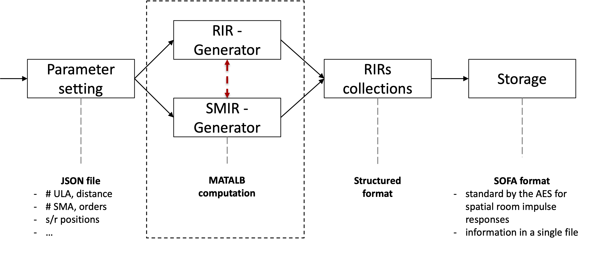

# RIR-SIMULATIONS
Repositiory for Room Impulse Response (RIR) simulations of controlled rooms with Uniform Linear Array (ULA) and Spherical Microphone Array (SMA).

The repository is based on: 
- [RIR_Generator](https://github.com/ehabets/RIR-Generator)
- [SMIR_Generator](https://github.com/ehabets/SMIR-Generator)

## Simulation pipeline
The following image depicts the general pipeline for the devised RIR simulation framework.


## Folder structure
```
rir-simulations
├── src                       # source code folder
│   ├── lib           		  # utils functions folder
│   └──   ├── ...
├── configurations   		  # folder with JSON files
│   ├── configuration.json    # JSON file for simulation parameter setting
├── imgs                      # image folder
│   ├── ...           		
├── README.md
└── LICENSE
```

## Setup


The file [generate_pipeline.m](/generate_pipeline.m) contains an example of a complete RIR simulation. 

This script generates the desidered RIR according to the configuration defined in [configuration.json](/configurations/configuration.json) file.
