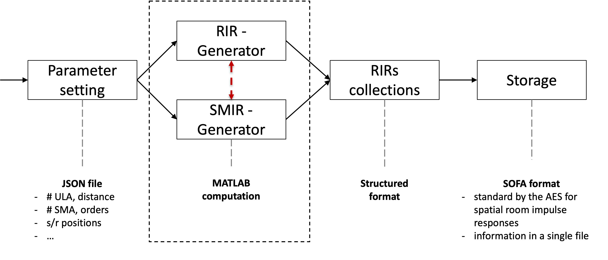

# RIR-SIMULATIONS
Repositiory for the RIR simulations of controlled room acoustics with ULA and SMA.

## Simulation pipeline
The following image depicts the general pipeline for the desired RIR simulation framework.



## Folder structure
```
rir-simulations
├── src                     			# source code folder
│   ├── lib           		# utils functions folder
│   └──   ├── ...
├── configurations   					# folder with JSON files
│   ├── x.json           		# JSON file for simulation parameter setting
├── imgs
│   ├── ...           		# image folder
├── README.md
└── LICENSE
```